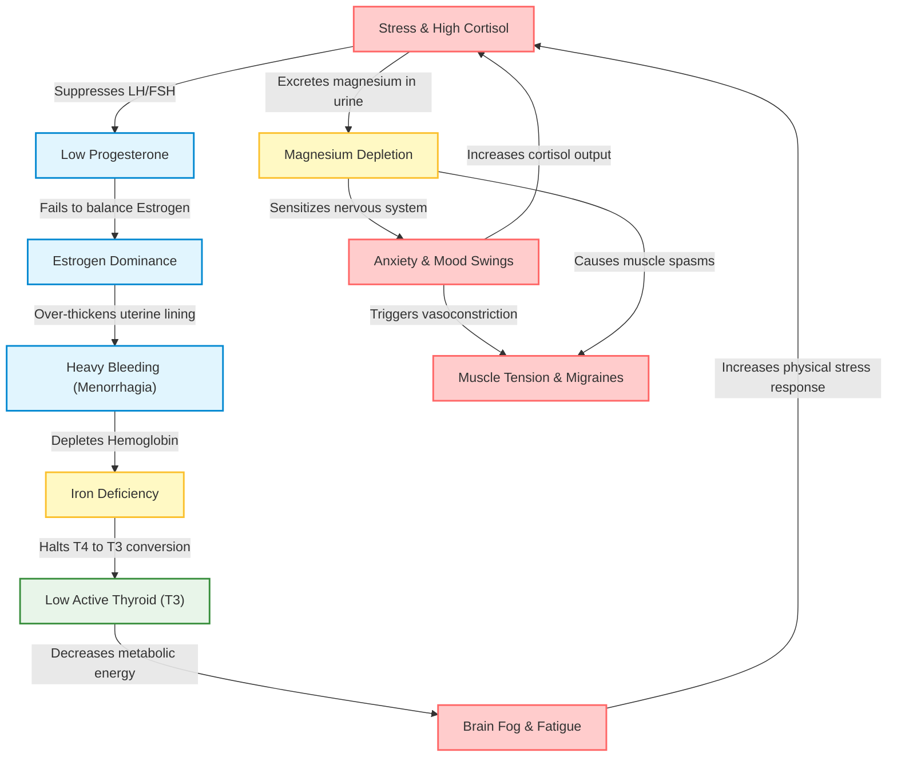

# Women's Daily Health: Menstruation, Hormones, Deficiencies, and Mental Health

This document outlines the biological mechanisms, everyday manifestations, and evidence-based management strategies for common, non-fatal health challenges faced by women. It emphasizes the physiological connections between the reproductive, nervous, and endocrine systems.

---

## 1. Core Health Domains

### A. Menstrual Cycle Related Issues
*   **Dysmenorrhea (Period Cramps):**
    *   *The "Why" (Biology)*: Uterine cells release **prostaglandins** (inflammatory compounds) to trigger uterine muscle contractions to shed the lining. Excess prostaglandins cause hyper-contraction, reducing oxygen supply to the uterine tissue (transient ischemia), resulting in pain.
    *   *Everyday Terms*: Cramps in the lower abdomen, lower back, and inner thighs (due to pelvic nerve stimulation sharing pathways with leg nerves).
    *   *Interventions & Supplements*: 
        *   **Magnesium Glycinate**: Relaxes uterine smooth muscle.
        *   **Omega-3 Fatty Acids (Fish Oil)**: Blocks prostaglandin pathways, acting as a natural anti-inflammatory.
        *   **Heat Therapy**: Promotes pelvic blood flow, alleviating ischemia.
*   **PMS & Premenstrual Dysphoric Disorder (PMDD):**
    *   *The "Why" (Biology)*: The luteal phase is marked by a drop in **estrogen** and **progesterone**. Estrogen acts as a modulator for serotonin and dopamine; when it drops, neurotransmitter synthesis decreases, causing mood fluctuations. PMDD is a genetic, hypersensitive cellular response to normal progesterone metabolites (like allopregnanolone) in the brain.
    *   *Everyday Terms*: Extreme mood swings, irritability, crying spells, fatigue, bloating, and breast tenderness.
    *   *Interventions & Supplements*:
        *   **Calcium (600–1200 mg/day)**: Stabilizes neuromuscular excitability and alleviates physical premenstrual symptoms.
        *   **Vitamin B6 (Pyridoxine)**: Essential cofactor for serotonin synthesis.
        *   **Chasteberry (Vitex)**: Modulates prolactin levels and supports progesterone production.
*   **Menorrhagia (Heavy Bleeding):**
    *   *The "Why" (Biology)*: Often caused by **estrogen dominance** (insufficient progesterone to balance estrogen), leading to an over-thickened uterine lining, or structural factors like benign fibroids.
    *   *Everyday Terms*: Bleeding that requires changing a pad/tampon every 1–2 hours, or bleeding lasting longer than 7 days.
    *   *Interventions & Supplements*:
        *   **Iron + Vitamin C**: Restores iron lost through heavy bleeding.
        *   **Vitamin K2**: Essential for proper blood coagulation pathways.

---

### B. Hormonal Imbalances (PCOS & Subclinical Thyroid Issues)
*   **PCOS/PCOD (Polycystic Ovary Syndrome):**
    *   *The "Why" (Biology)*: Primarily driven by **insulin resistance**. Elevated insulin levels stimulate the ovarian cells to produce excess **androgens** (male hormones like testosterone) instead of converting them to estrogen. This halts the ovulation cycle, causing follicle growth to freeze, creating cysts.
    *   *Everyday Terms*: Irregular/absent periods, stubborn weight gain around the abdomen, cystic acne along the jawline, hirsutism (excess facial/body hair), and thinning scalp hair.
    *   *Interventions & Supplements*:
        *   **Myo-Inositol & D-Chiro Inositol (40:1 ratio)**: Sensitizes insulin receptors, restoring ovulation and reducing androgens.
        *   **Berberine**: Natural insulin sensitizer comparable to metformin.
        *   **Spearmint Tea**: Decreases free testosterone levels.
*   **Subclinical Hypothyroidism:**
    *   *The "Why" (Biology)*: The thyroid gland produces insufficient thyroxine (T4), or the liver/cells fail to convert T4 to active triiodothyronine (T3). Often triggered by stress (cortisol blocks T4-to-T3 conversion) or nutrient deficiencies.
    *   *Everyday Terms*: Chronic cold hands and feet, unexplained weight gain, slow digestion (constipation), thinning outer eyebrows, and overall exhaustion.
    *   *Interventions & Supplements*:
        *   **Selenium & Zinc**: Essential cofactors for converting T4 to active T3.
        *   **Ashwagandha**: Supports hypothalamic-pituitary-thyroid function.

---

### C. Nutritional Deficiencies
*   **Iron Deficiency (Anemia):**
    *   *The "Why" (Biology)*: Depletion of iron stores leads to insufficient hemoglobin production, reducing oxygen transport to brain, muscle, and endocrine cells.
    *   *Everyday Terms*: Restless legs, breathlessness on stairs, dizziness when standing up, pale skin, cold extremities, and severe fatigue.
    *   *Interventions*: **Iron Bisglycinate** (easier on the stomach than ferrous sulfate) taken with **Vitamin C** to increase absorption.
*   **Vitamin D3 Deficiency:**
    *   *The "Why" (Biology)*: Vitamin D behaves as a steroid hormone regulator in the body. It governs calcium absorption, immune function, and estrogen synthesis.
    *   *Everyday Terms*: Dull bone aches, muscle weakness, recurring colds, and winter sadness.
    *   *Interventions*: **Vitamin D3 + K2** (K2 directs calcium to bones instead of arteries).
*   **Magnesium Deficiency:**
    *   *The "Why" (Biology)*: Magnesium regulates 300+ enzymatic reactions. It manages muscle relaxation, GABA (calming neurotransmitter) activation, and blood sugar.
    *   *Everyday Terms*: Leg cramps (especially at night), muscle twitches, high anxiety, heart palpitations, and chocolate cravings (cocoa is rich in magnesium).
    *   *Interventions*: **Magnesium Glycinate** (highly bioavailable, cross blood-brain barrier for anxiety) or **Magnesium Malate** (for daytime energy).

---

### D. Mental Health Concerns
*   **Generalized Anxiety & Reproductive Shifts:**
    *   *The "Why" (Biology)*: Fluctuations in progesterone levels reduce **GABA** receptor binding, stripping the nervous system of its natural calming mechanism.
    *   *Everyday Terms*: Constant worrying, tight chest, racing heart, and overthinking.
    *   *Interventions*: **L-Theanine** (stimulates alpha brain waves) and **GABA-supportive** herbs like Lemon Balm.
*   **Estrogenic Brain Fog:**
    *   *The "Why" (Biology)*: Estrogen supports cerebral glucose metabolism and blood flow. A drop in estrogen decreases energy utilization in the brain.
    *   *Everyday Terms*: Forgetfulness, inability to focus, and word-finding difficulties.
    *   *Interventions*: **Omega-3s** (DHA for brain structure) and **Ginkgo Biloba**.

---

## 2. The Interconnection Matrix

The endocrine, nervous, and hematopoietic systems are not isolated; they form a complex, highly feedback-driven web. 

### Explaining the Core Loops:

1.  **The Stress-Cycle Loop**: Chronic mental stress releases **cortisol**. High cortisol suppresses the hypothalamus, leading to lower Luteal Hormone (LH) and Follicle-Stimulating Hormone (FSH). This halts ovulation and results in **Low Progesterone**. Progesterone balances estrogen; without it, **Estrogen Dominance** occurs, causing heavy bleeding, painful periods, and intense PMS cramps.
2.  **The Bleeding-Thyroid Loop**: Heavy bleeding caused by hormonal imbalance directly drains the body's iron stores, creating **Iron Deficiency**. Iron is a necessary cofactor for the enzyme *thyroid peroxidase* (which creates thyroid hormones). Without iron, thyroid synthesis fails, leading to **Hypothyroidism** (causing extreme fatigue, weight gain, and brain fog).
3.  **The Magnesium-Anxiety-Migraine Loop**: Stress causes the kidneys to excrete **magnesium** in urine. Low magnesium limits the activation of GABA (the brain's calming neurotransmitter), worsening **Anxiety**. Anxiety triggers physical hyperventilation and sympathetic nervous system activation, causing vasoconstriction. Simultaneously, low magnesium prevents muscle relaxation. Combined, this causes severe **Tension Migraines**, jaw clenching, and full-body aches.

---

## 3. Supplement & Action Protocol

| Supplement | Recommended Form | Targeted Daily Dose | Primary Mechanism of Action | Best Time to Take |
| :--- | :--- | :--- | :--- | :--- |
| **Magnesium** | Glycinate or Bisglycinate | 200–400 mg | Relaxes smooth muscles (cramps); crosses the blood-brain barrier to calm nervous tension. | Night (with dinner/before bed) |
| **Inositol** | Myo-Inositol + D-Chiro (40:1 ratio) | 2000–4000 mg | Improves insulin sensitivity; restores ovulation cycles in PCOS; balances ovarian hormones. | Morning (with food) |
| **Iron** | Bisglycinate | 18–36 mg | Rebuilds red blood cells; resolves anemia and supports thyroid hormone synthesis. | Morning (on empty stomach with Vitamin C) |
| **Vitamin D3 + K2** | Liquid/Softgel | 2000–5000 IU | Acts as a hormone regulator; supports bone density and estrogen production. | Morning (with a fat-containing meal) |
| **Vitamin B6** | Pyridoxal-5-Phosphate (P5P) | 50–100 mg | Essential cofactor for converting tryptophan into serotonin, reducing PMS/PMDD mood crashes. | Morning |
| **Omega-3** | High EPA/DHA Fish Oil | 1000–2000 mg | Suppresses inflammatory prostaglandin synthesis, easing cramps and pelvic pain. | Evening (with dinner) |

---

## 4. Everyday Relief & Lifestyle Guidelines

### Cycle Syncing Actions
1.  **Follicular Phase (Days 1–14)**: Focus on strength building and iron-rich foods (lean meats, spinach, lentils) to replace blood loss. 
2.  **Luteal Phase (Days 15–28)**: Prioritize restorative movement (yoga, walking) to avoid spiking cortisol, and increase intake of complex carbohydrates to stabilize serotonin levels.
3.  **During Cramps**: Apply local heat to the pelvis, consume warm fluids (chamomile or ginger tea, which inhibit prostaglandins), and perform gentle pelvic stretches (e.g., child's pose).
